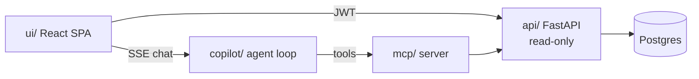

# UI plan

A React SPA over the existing read-only API: three views (listing, dashboard,
map) plus an LLM copilot that can both answer questions and reconfigure the
views to illustrate its answers.

This doc is the design and the build order. It assumes the API as it stands
today — which, once actually checked, needs no changes to begin (§6).

---

## 1. The one idea everything hangs off

**The server declares what can be shown; the client holds a serializable
description of what *is* shown.**

Two halves:

- **Catalogs (server) — already published, nothing to build.**
  `/openapi.json` describes every endpoint, column and type (generated from
  the response models, so it can't drift); `/meta/metrics` describes how every
  number is calculated; `/dimensions/*` supplies the real enum vocabularies.
  The client generates its types from these rather than hand-maintaining a
  parallel list.
- **ViewState (client).** Everything the user has configured — view, filters,
  columns, sort, selected entities, date range, chart type — lives in **one
  plain JSON object**, and the UI is a pure function of it.

Why this matters more than it looks:

| It gives us | For free |
|---|---|
| Shareable/bookmarkable URLs | ViewState ⇄ URL is one codec |
| Undo/redo | It's a reducer over a JSON object |
| The copilot | The bot emits *ViewState patches* — same channel as a click |
| Testability | Assert on state, no browser needed |
| Consistent vocabulary | Client, URL, and LLM all speak the catalog's names |

**This is the part that must be right in Phase 0**, before any chart is
drawn. The copilot in §5 is only cheap to build later if we do this now.

---

## 2. Architecture



New packages, following the existing separation:

| Package | What | Notes |
|---|---|---|
| `ui/` | React + Vite SPA | Built to static assets |
| `copilot/` | LLM agent loop | Phase 4. Own service, like `mcp/` |

**Serving.** Vite dev server proxies `/api` and `/copilot` in development. The
SPA itself runs as **its own container** (`ui/`), matching every other
service; the edge nginx proxies `/` to it exactly like it proxies `/api`,
`/mcp`, `/copilot` — nothing is bind-mounted from the host.

> Changed twice during the build. First to "nginx serves the bundle from a
> bind-mounted `dist/`" (replacing the original plan's "FastAPI serves it via
> `StaticFiles`" — nginx was already the edge, so serving files there avoided
> giving a read-only-database service a static-file responsibility). Then to
> the current shape, because a bind mount meant the container only worked if
> someone had already run `npm run build` on the host — not self-contained,
> not deployable as-is. `ui/Dockerfile` is a two-stage build: Node builds the
> SPA, then `nginxinc/nginx-unprivileged` (non-root, matching every other
> service) serves the static output. The image needs nothing at runtime — no
> env vars, no secrets — so the same image is right for `docker compose up`
> locally and for shipping to a cloud host later.

**A real bug this surfaced:** the edge nginx has shown `unhealthy` in
`docker compose ps` for this entire project, unrelated to anything built here.
Root cause, confirmed by reproducing it directly: its healthcheck runs `wget
http://localhost/health` inside an Alpine (musl) image, `localhost` resolves
to `::1` first (`getent hosts localhost` confirms it), nginx only binds IPv4,
and busybox `wget` — unlike `curl`, which every other service's healthcheck
uses — does not fall back to the next resolved address on connection refused.
The server was correct and serving traffic the whole time; it was failing its
own probe. Fixed by using `127.0.0.1` explicitly, on both the edge nginx and
the new `ui` container's healthchecks.

**Why `copilot/` is its own service, not a router in `api/`:** it needs an
outbound Anthropic key and a tool-calling loop, and it reaches data through
`mcp/` — so it never needs DB access at all. Keeping it out of `api/`
preserves "the API only reads the database, nothing else." Same reasoning
that made `mcp/` a thin separate service.

---

## 3. Stack choices

| Concern | Pick | Why |
|---|---|---|
| Framework | **React + TypeScript + Vite** | As discussed |
| Routing | **None** | See below |
| Server state | **TanStack Query** | Caching/dedup/pagination against a REST API is exactly its job |
| Client state | **Zustand** (or `useReducer`) | ViewState is one small object; Redux is overkill |
| Tables | **TanStack Table** (headless) | Sorting/column config/virtualization, no imposed styling |
| **Charts** | **Observable Plot** | See below |
| **Map** | **MapLibre GL JS** | See below |

### No router — dropped during the build

`react-router-dom` was installed, then removed. Two reasons, and the first is
the real one:

- **It would be a second source of truth.** ViewState already holds `view`, and
  the codec in §1 already maps state to the URL. A router would own "which view
  am I on" in parallel with ViewState, and the two would drift. View switching
  is `dispatch({type:'setView'})` plus `history.pushState`, which is what the
  codec was going to do anyway.
- It also happened to be the only dependency with a security advisory
  (a high-severity CSRF issue in the installed range). Removing it took the
  project to **0 vulnerabilities**, which was a pleasant side effect of a
  decision made on design grounds.

### Charts: Observable Plot, not raw d3

Your d3 instinct isn't wrong — **Observable Plot is built on d3**, by d3's
author. It keeps the escape hatch and removes the boilerplate.

| Option | Verdict |
|---|---|
| **Observable Plot** | **Recommended.** Declarative, excellent defaults, d3 underneath. A chart is an options object — which maps cleanly to a JSON spec the copilot can emit |
| Raw d3 | Maximum power, but you hand-build axes/legends/tooltips for every chart. Wrong altitude for a dashboard |
| ECharts | Very capable, strong with large series and built-in brushing. Config is verbose and less semantic. Solid fallback |
| Vega-Lite | Most LLM-friendly (charts *are* JSON), but heavier and interactions get awkward |
| Recharts / Nivo | Pleasant in React, weaker on dense analytical work |

**Important:** we define **our own small chart spec** and translate it to
Plot — the copilot emits *our* schema, never raw library config. That keeps
the library swappable and the LLM's output validatable.

> I'd rather show than tell here: **Phase 0 includes a throwaway visual
> spike** rendering the same real Dubai price series in Plot and ECharts, so
> you can judge the look with actual data instead of my adjectives.

### Map: MapLibre GL JS

Open-source, OSM tiles, vector rendering. Chosen over Leaflet because your
requirements need things Leaflet can't do well:

- **Choropleth over ~192 area polygons** — WebGL handles this smoothly
- **3D extrusion** (`fill-extrusion`) — height by growth rate or volume, which
  is a native feature, not a hack
- **Zoom-driven semantics** (areas → projects → buildings) — layer visibility
  by zoom is built in

Add **deck.gl** later only if building-level point counts demand it.

### On React Native

Honest caveat: **Observable Plot and MapLibre GL JS are web-only.** A future
mobile app shares the *logic*, not the *rendering*. So keep the API client,
ViewState, and catalog types in a framework-agnostic `ui/src/core/` from day
one — then a RN app swaps only the render layer. Don't plan for RN beyond
that discipline now.

---

## 4. The three views

### 4.1 Listing

Configurable tables over any entity. **The joins you asked for already exist
server-side** — a transaction row comes back with `area_name_en`,
`project_name_en`, `usage`, `prop_type`, `prop_subtype` and provenance
already flattened onto it. So "entity or join of entities" is really a
dropdown over the endpoints we already have:

| Dropdown option | Endpoint | Already joined with |
|---|---|---|
| Transactions | `/facts/transactions` | Area, Project, PropertyType, Source |
| Rent contracts | `/facts/rents` | Area, Project, PropertyType, Source |
| Buildings | `/dimensions/buildings` | Project, Area |
| Projects | `/dimensions/projects` | Developer, Area |
| Areas | `/dimensions/areas` | — (+ migration lineage) |

**No generic join builder.** It would buy flexibility nobody asked for at the
cost of an arbitrary SQL surface and unpredictable query plans. The
pre-joined projections above are what the analytical questions actually need.

**Column definitions come from `/openapi.json`, not a hand-maintained list.**
It's generated from the Pydantic response models, so `openapi-typescript`
gives us typed columns that cannot drift from the API. Nothing to build.

Filters are per-endpoint and rendered generically — `q` text search where it
exists, date ranges, numeric ranges, entity pickers, enums fed by
`/dimensions/*`. All already supported.

**Sorting is client-side** (TanStack Table does it out of the box, no API
change). Worth stating the consequence plainly so nobody is surprised later:
this sorts **the rows currently loaded**, not the full result set — "most
expensive transaction in Dubai" is a job for `/analytics/area-ranking` or a
filter, not for clicking a column header on page 1. If whole-set ordering is
wanted later, it's an additive `sort_by`/`sort_dir` param, not a redesign.

✅ **Nothing here is blocked.**

### 4.2 Dashboard

Configurable multi-series comparison: pick entities (areas/projects), a date
range, and a metric; get trend lines, YoY/MoM growth, and comparison.

**Ready to build today** — `/marts/area-monthly`, `/marts/project-monthly`,
`/analytics/growth`, `/analytics/compare`, `/analytics/area-ranking` and
`/meta/metrics` already cover it.

Two things to honor, because the API already does:
- Every response carries `caveats` and `methodology` — **render them**, don't
  strip them. Yields are gross; medians are mix-shift-prone.
- Sample sizes come with every aggregate — surface them, so a spike backed by
  3 sales is visibly a spike backed by 3 sales.

### 4.3 Map

Default: choropleth of Dubai, color intensity by price per m². Then
configurable along four axes:

| Axis | Options |
|---|---|
| Granularity | areas → projects → buildings (zoom-driven) |
| Semantics | sales / rents / yield |
| Encoding | color (heat) or 3D extrusion height (growth %, volume) |
| Filters | date range, usage, property type, min sample |

**Mostly ready today** — `/geo/areas` returns boundaries with per-area latest
metrics for styling; `/geo/projects` and `/geo/buildings` return points.

One caveat worth designing around: **not every area has a boundary polygon**
(geocoding is best-effort, and `geo_match_method` marks precise vs coarse).
The map must degrade honestly — centroid dot instead of polygon, visibly
distinct — never silently omit an area or fake a shape.

---

## 5. The copilot (design now, build in Phase 4)

A dialog that can be opened anywhere, which can both **answer** and **act**.

**Two tool families, one loop:**

| Family | Source | Examples |
|---|---|---|
| Data | Existing MCP server | `rank_entities`, `compare`, `get_transactions` |
| UI | New, thin | `set_view_state(patch)`, `highlight(ids)`, `add_series(...)` |

The flow: user asks → agent calls MCP tools for real numbers → answers in
prose → *optionally* emits a ViewState patch so the UI illustrates the
answer. "Which areas grew fastest last year?" → prose ranking **and** the
dashboard reconfigures to plot exactly those areas.

**What Phase 0 must get right for this to be cheap later:**

1. Every UI capability is reachable by a **ViewState patch**, not only by a
   click handler. If the bot can't express it as state, it can't drive it.
2. ViewState is **validated** (zod schema) — an LLM-produced patch is
   untrusted input and gets checked like any other.
3. Patches are **applied through the same reducer** as user actions, so undo
   works identically whether a human or the bot made the change.

**Browser auth, decided during the build.** The SPA holds a JWT, not an API
key — and an API key shipped in a browser bundle is a published key. So the
dock sends its existing access token, and the copilot verifies it by presenting
it to the API and seeing whether it is accepted. That avoids giving a second
service a copy of the signing secret (a second copy is a second place to leak
it). It is the *only* reason the copilot knows the API's address; it still
fetches no data that way.

**Guardrails, deliberate:**
- The copilot reaches data **only through MCP** — never the DB, never raw SQL.
- The Anthropic key lives server-side; the browser never sees it.
- Auth **fails closed**: with no keys configured, every request is rejected.
  This service spends money per request, so refusing is the only acceptable
  direction to be wrong in.
- The tool loop is **bounded** (`max_turns`); exhausting it returns an
  explanation rather than presenting a partial state as a finished answer.
- UI patches are **proposals the user can undo**, and the bot never triggers
  destructive or outbound actions — there are none in a read-only product,
  and that should stay true.
- MCP tool output is **data, not instructions** — the agent loop must not
  treat returned text as commands.

---

## 6. API gaps

**There are none. No API work is needed to start.**

My first draft claimed otherwise; that was wrong, and worth recording why so
the mistake isn't repeated. I conflated "missing ergonomics" with "missing
data." What I listed as gaps and what they actually were:

| First claimed | Reality |
|---|---|
| ~~Join support~~ | Already joined server-side — rows carry `area_name_en`, `project_name_en`, `usage`, `prop_type` (§4.1) |
| ~~Dataset catalog endpoint~~ | `/openapi.json` already describes every column and type, generated from the response models so it cannot drift |
| ~~Server-side sorting~~ | Client-side sorting is sufficient for now (per direction) |
| ~~Column projection~~ | Payloads are modest; select columns client-side |

### On `total` — checked properly, it is not a bug

An earlier draft of this doc said `total` was "declared in the envelope but
never populated." **That was wrong** — I grepped for `total=` and missed the
dict-literal `"total":` assignments. Verified live:

| Endpoint family | `total` | Why |
|---|---|---|
| `/dimensions/areas` | `428` | Small table, `COUNT` is trivial |
| `/dimensions/projects` | `3634` | Same |
| `/dimensions/buildings` | `148543` | Same |
| `/facts/transactions` | `null` | 1.75M rows — `COUNT` costs as much as the query |
| `/facts/rents` | `null` | 10.3M rows — same |

This is **deliberate, documented, and consistently implemented.** The schema
says so in as many words: *"Total matching rows, when cheap to compute. Null
on large fact scans where counting would cost as much as the query itself."*
Dimensions get counted; facts don't. `_count()` exists and is called exactly
where it's affordable.

Worth noting alongside it: **facts endpoints already refuse an unfiltered
scan** — `/facts/transactions` with no filter returns 422 requiring one of
`area_id`, `building_id`, `date_from`, `project_id`. The expensive query
shape the null `total` protects against is already blocked at the door.

So there is nothing to fix. There *is* a product question — see decision 5 in
§8 — about whether the listing view needs exact counts on facts, which is a
feature with a latency cost, not a defect.

**Auth — decided: keep it simple for now.** Access token in memory, refresh
token in `localStorage`, no API change. Chosen to keep development moving;
revisited once the UI is built and tested (§8, decision 2).

---

## 7. Phases

| Phase | What | Notes |
|---|---|---|
| **0. Foundation** | `ui/` skeleton · auth · **ViewState + reducer + URL sync** · TS types generated from `/openapi.json` · chart-library visual spike | Pure frontend — **no API work** |
| **1. Listing** | Entity dropdown, column config, filters, client-side sort, pagination | The most-used view |
| **2. Dashboard** | Multi-entity trend/comparison charts, metric picker, caveat rendering | API ready |
| **3. Map** | Choropleth → zoom-driven granularity → 3D extrusion | API ready |
| **4. Copilot** | `copilot/` service, MCP tool loop, UI-patch tools, chat dock | Needs 0–3 for surface area to drive |

Every API the UI needs already exists, so 1–3 are parallelizable. Phase 0 is
the only hard gate — and it gates on the ViewState foundation (§1), not on
data.

---

## 7b. Running it

```
cd ui && npm install
npm run dev            # proxies /api and /copilot; needs the stack up
npm run build          # -> ui/dist, which nginx serves read-only
npm run typecheck      # tsc -b — NOT `tsc --noEmit`, see below
npx vitest run
```

**`npx tsc --noEmit` in `ui/` silently checks nothing.** `tsconfig.json` is a
solution-style file (`"files": []` plus project references), so it type-checks
an empty program and exits 0 however broken the code is. Verified by planting a
deliberate type error and watching it pass. Use `npm run typecheck` (`tsc -b`).

The copilot needs `ANTHROPIC_API_KEY` set. Without it the service still boots
and `/health` reports `"configured": false`; chat requests return one clear
explanation instead of failing obscurely.

---

## 8. Decisions I need from you

1. **Charts** — confirm Observable Plot, or wait for the Phase 0 visual spike
   before deciding? (I'd build the spike either way; it's a day.)
2. ~~**Auth**~~ — **decided: in-memory access token + `localStorage` refresh
   token.** No API change, keeps development simple.

   What that trades away, stated once so it isn't a surprise later: a refresh
   token in `localStorage` is readable by any XSS on the page. The blast
   radius is bounded — the API is **read-only**, so a stolen token reads data
   but cannot alter, delete, or spend anything — but it *is* a data-exposure
   risk, not a theoretical one.

   **Deferred, not dropped:** before any deployment reachable outside a
   trusted network, move the refresh token to an httpOnly, `SameSite=Strict`,
   `Secure` cookie. That's a small API change (set/clear the cookie on
   `/auth/login` and `/auth/refresh`) plus CORS credentials — a couple of
   hours, not a redesign, which is exactly why deferring it is safe. Tracked
   as the **exit criterion for going public**, not as tech debt to
   rediscover.
3. **Phase order** — all three views are unblocked, so this is purely about
   what you want to see first. Listing is the most useful; the map is the
   most impressive.
4. **Design language** — any existing palette/brand to match, or free rein? The
   map and charts should share one color system, so this is worth settling
   before Phase 2.
5. **Exact counts on facts listings** — dimensions already return `total`;
   facts deliberately don't (§6). So a transactions table can show *"showing
   1–50, more available"* but not *"1–50 of 4,812"*. Three options:

   | Option | Cost | Verdict |
   |---|---|---|
   | Keep `has_more` only | None | Fine for infinite scroll or next/prev. **My recommendation** |
   | Opt-in `with_total=true` | A real `COUNT` per request, only when asked | Right shape if you want the count on demand |
   | Estimated count | Cheap, but approximate | A precise-looking number that's actually a guess — I'd avoid it |

   Note this is genuinely optional: every filtered facts query is already
   bounded (an unfiltered scan is refused outright), so pagination works
   correctly without it. It's a nicety, not a blocker for production.
